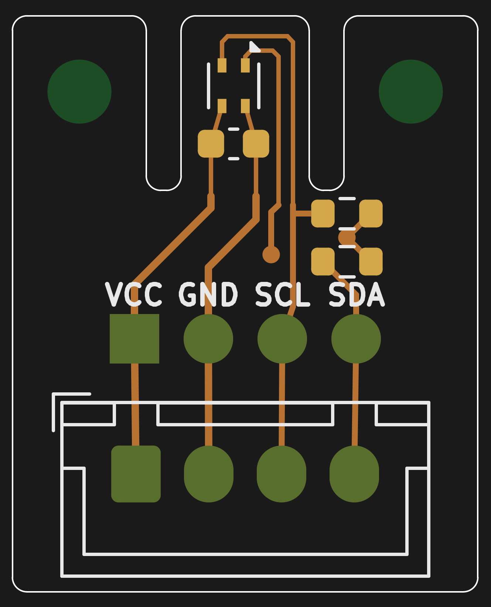
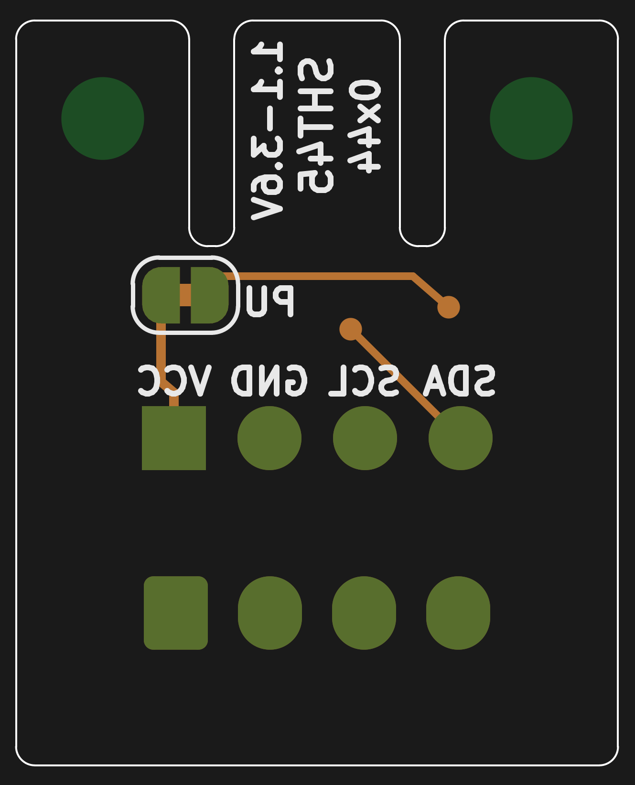

# SHT45 Breakout Kartı

Sensirion **SHT45** (±1.0 %RH, ±0.1 °C, I²C) nem ve sıcaklık sensörü için küçük bir breakout (modül) kartı.
Şema, PCB, Gerber, delik dosyası ve JLCPCB montaj (BOM/CPL) dosyaları bu depoda.

| Özellik | Değer |
|---|---|
| Kart boyutu | **16.0 × 19.8 mm**, 2 katman, 1.6 mm FR4, 2 adet M2 montaj deliği |
| Besleme | **1.08 … 3.6 V** (5 V ile çalışmaz, aşağıya bakın) |
| Arayüz | I²C, adres **0x44** (SHT45-AD1B), en fazla 1 MHz (Fm+) |
| Konnektör | J1: 1×4, 2.54 mm pin header, J2: 4 pinli JST XH (2.50 mm). İkisinde de sıra `VCC GND SCL SDA` |
| Parçalar | U1 SHT45 (DFN-4 1.5×1.5), C1 100 nF 0603, R1/R2 10 kΩ 0603, JP1 lehim köprüsü |

 

(Görseller KiCad'in değil, doğrudan üretilen Gerber dosyalarının `gerbv` ile çizilmiş halidir.
Alt yüz, kartın üstünden bakılıyormuş gibi gösterildiği için yazılar ters görünüyor. Düz okunan
hali `docs/pcb_bottom.png` dosyasında.)

## Tasarım kararları (Sensirion dokümanlarından)

Tasarımda şu belgeler kullanıldı: *Datasheet SHT4x v7.3*, *Design Guide for Humidity and
Temperature Sensors*, *Handling Instructions SHTxx*, *Contamination Guide*, *Creep Mitigation
SHT4x* ve *Heater Decontamination SHT4x* ([ürün sayfası](https://sensirion.com/products/catalog/SHT45)).

1. **Devre, datasheet Fig. 1'deki tipik uygulama devresiyle aynı:** SDA/SCL için 10 kΩ pull-up,
   VDD–VSS arasında 100 nF. Pull-up değeri, datasheet'teki minimum değerin (VDD ≥ 1.62 V için
   390 Ω) çok üzerinde.
2. **Land pattern datasheet Fig. 17'ye göre çizildi:** 0.5 × 0.3 mm pad'ler, 0.8 mm dikey ve 1.4 mm
   yatay aralık (KiCad'deki `Sensirion_DFN-4_…_SHT4x_NoCentralPad` footprint'i).
   **Orta pad (die pad) lehimlenmiyor** ve sensörün altında pad'ler dışında **bakır yok**
   (datasheet 5.3). Lehimlenmiş bir die pad, sensörün içindeki ısıtıcıyı soğutur (heat sink etkisi).
3. **Termal izolasyon:** Sensör, kartın geri kalanından iki adet 1.2 mm'lik freze yarığıyla ayrılmış
   4.4 mm genişliğinde bir "dil" üzerinde duruyor (Design Guide bölüm 3 / Fig. 8b, 11). Dile sadece 4 adet **0.15 mm**
   iz geçiyor. Dilde bakır dolgu (pour) yok. Böylece header'dan ve bağlı karttan gelen ısı sensöre
   daha az ulaşıyor.
4. **C1, sensörün VDD/VSS pinlerine doğrudan bağlı** (≈0.6 mm uzaklıkta). Isıtıcı çalışırken
   çekilen 100 mA'e varan akım darbeleri için bu yakınlık önemli.
5. **Pull-up'lar ve lehim köprüsü ana gövdede**, sensörden uzakta. **JP1** (alt yüzde, "PU")
   fabrikadan kapalı (köprülü) gelir. Aynı I²C hattında zaten pull-up varsa (ör. birden fazla
   modül kullanıyorsanız) iki pad arasındaki ince izi maket bıçağıyla kesin. Böylece iki pull-up
   birlikte devreden çıkar.
6. **Kolay kullanım için yaygın pin sırası** (`VCC GND SCL SDA`). Pin etiketleri iki yüzde de
   yazılı, 1 numaralı pin kare pad'li. Pin header (J1) ile JST XH (J2) aynı sütunlarda, J2
   hemen J1'in altında. İkisinden birini ya da ikisini birden takabilirsiniz.
7. **Montaj delikleri:** Dilin iki yanındaki "kulaklarda" 2 adet M2 delik (2.2 mm, kaplamasız)
   var. Kulaklar da dile değmiyor, böylece vidalanan yüzeyin sıcaklığı sensöre doğrudan geçmiyor.

## Dosyalar

```
hardware/                 KiCad 7 projesi (.kicad_pro / .kicad_sch / .kicad_pcb) + DRC raporu
production/
  sht45_breakout_gerbers.zip   → PCB siparişi için bunu yükleyin
  gerbers/                     açık hali (Gerber X2, Excellon, job dosyası)
  sht45_breakout_bom.csv       JLCPCB montaj BOM'u (LCSC numaralarıyla)
  sht45_breakout_cpl.csv       JLCPCB montaj pozisyon (CPL) dosyası
docs/                     şema PDF'i, PCB PDF/PNG görselleri
tools/                    tasarımı ve tüm çıktıları sıfırdan üreten betikler
```

Proje dosyaları KiCad 7 ile üretildi, KiCad 8 ve 9 ile de açılabilir. Şema ve PCB aynı UUID'lerle
bağlı, bu yüzden KiCad'de "Update PCB from Schematic" sorunsuz çalışır.

## JLCPCB siparişi

### Sadece PCB
1. <https://jlcpcb.com> → *Order now* → `production/sht45_breakout_gerbers.zip` dosyasını yükleyin.
2. Önerilen ayarlar: 2 Layers, FR-4, **1.6 mm** (termal kütleyi azaltmak isterseniz 1.0 mm de olur),
   renk serbest, yüzey kaplaması **ENIG** (0.5 × 0.3 mm'lik DFN pad'lerinde daha düz bir yüzey
   sağlar; HASL lead-free de çalışır).
3. *Remove Order Number* seçeneğini işaretleyin. Kartta sipariş numarasına uygun boş yer yok.
4. Kartta 2 adet 0.3 mm via, 8 adet konnektör deliği (1.0 ve 0.95 mm), 2 adet 2.2 mm kaplamasız
   montaj deliği ve 2 adet 1.2 mm frezelenmiş yarık var. Minimum iz/boşluk 0.15 mm.
   Bunların hepsi standart (ek ücretsiz) üretim sınırları içinde.

### Montajlı (PCBA), önerilen yöntem
SHT45 bacaksız, 1.5 mm'lik bir DFN kılıf. Sensirion **elle (havya ile) lehimlemeyi önermiyor**
(Handling Instructions). Bu yüzden en sorunsuz yol, kartları JLCPCB'ye dizdirmek:

1. PCB siparişinde *PCB Assembly* seçeneğini açın, *Top side* seçin.
2. BOM olarak `production/sht45_breakout_bom.csv`, CPL olarak `production/sht45_breakout_cpl.csv`
   dosyalarını yükleyin.

   | Ref | Parça | LCSC |
   |---|---|---|
   | U1 | SHT45-AD1B-R2 | C9900092421 |
   | C1 | 100 nF 0603 X7R | C14663 (basic) |
   | R1, R2 | 10 kΩ 0603 1% | C25804 (basic) |

3. **Önizleme ekranında U1'in yönünü kontrol edin:** pin-1 noktası, kart üstünde sensörün
   **sağ üst köşesindeki** üçgen işaretle aynı yerde olmalı. JLC'nin kütüphanesindeki DFN
   modelleri bazen 90°/180° kaymış gelebiliyor. Gerekirse önizlemede döndürün.
4. SHT45 stokta yoksa aynı footprint'e sahip **SHT45-AD1F-R2** (C5360602, üstü polyimid filtre
   zarlı, IP68) kullanılabilir. Parça numaralarını ve stok durumunu sipariş anında kontrol edin.
5. Konnektörler (J1, J2) ve JP1 montaj listesinde yok. Konnektörleri kendiniz lehimleyin, JP1 zaten bakır bir köprü.

> Not: Kart 10 × 10 mm'den büyük olduğu için tek parça olarak montaja uygun. JLC panelleme
> isterse sipariş ekranındaki *Panel by JLCPCB* seçeneği yeterli.

### Kendiniz dizecekseniz
Stencil ile no-clean pasta (Type 3 veya daha ince) sürüp hot-plate ya da sıcak hava kullanın
(tepe sıcaklık ≤ 260 °C). **Kartı yıkamayın, IPA ya da flux temizleyici kullanmayın**
(Handling Instructions: "Do not apply board wash"). Reflow'dan sonra ölçümde −1…−2 %RH'lik
bir sapma görülebilir, 1–3 gün içinde kendiliğinden kaybolur.

### Kendin dizmek için malzeme listesi (1 kart)

| Adet | Parça | Not |
|---|---|---|
| 1 | SHT45-AD1F-R2 veya SHT45-AD1B-R2 | F = üstü filtre zarlı, B = açık kılıf. Aynı footprint |
| 2 | 10 kΩ direnç, 0603 | R1, R2 (I²C pull-up) |
| 1 | 100 nF kondansatör, 0603, X7R, ≥10 V | C1 |
| 1 | 1×4 erkek pin header, 2.54 mm | J1, isteğe bağlı |
| 1 | JST XH 4 pin dik soket (B4B-XH-A) | J2, isteğe bağlı. "XH2.54" diye satılan klonlar da oturur |
| 2 | M2 vida + somun/spacer | İsteğe bağlı |

JP1 bir parça değil, bakır bir köprü. Lehim pastası no-clean olmalı.
Pasif parçalar 0603 seçildi, elle yerleştirmesi kolay.

## Kullanım

- **Sadece 3.3 V (veya daha düşük) sistemlerde doğrudan kullanın** (ESP32, RP2040, STM32,
  3.3 V Arduino'lar vb.). Pinlerdeki mutlak maksimum gerilim VDD + 0.3 V. 5 V'luk bir
  Arduino'da (Uno/Nano) VCC'yi 3.3 V pininden besleseniz bile Wire kütüphanesi SDA/SCL'yi
  dahili olarak 5 V'a çeker. Bu durumda bir **I²C seviye dönüştürücü** (ör. BSS138 modülü) kullanın.
- Adres **0x44**. Hazır kütüphaneler: Sensirion `arduino-i2c-sht4x`, Adafruit `Adafruit_SHT4x`,
  MicroPython/CircuitPython `adafruit_sht4x`.
- Datasheet'teki en basit okuma akışı:

  ```
  i2c_write(0x44, [0xFD])            # yüksek hassasiyetle ölç
  bekle(10 ms)
  d = i2c_read(0x44, 6)
  T  = -45 + 175 * (d[0]*256 + d[1]) / 65535      # °C
  RH =  -6 + 125 * (d[3]*256 + d[4]) / 65535      # %RH, 0..100 aralığına sınırlayın
  ```
- Dili kırmayın veya bükmeyin. Sensörün üstündeki açıklığı kapatmayın. Kartın konformal
  kaplamayla kaplanması gerekiyorsa sensörün üstünü koruyun (Kapton bant gibi).

## Yeniden üretme

Tasarım tamamen betiklerden oluşturuluyor. Ubuntu 24.04'te:

```bash
sudo apt install kicad poppler-utils zip gerbv   # KiCad 7.0
./tools/build.sh
```

- `tools/gen_schematic.py`: şemayı yazar.
- `tools/gen_pcb.py`: kart şeklini, yerleşimi ve yolları pcbnew API ile oluşturur. Pad
  konumlarını kontrol eder.
- `tools/drc.py`: DRC çalıştırır (`hardware/drc_report.txt`).
- `tools/jlc_assembly.py`: JLCPCB BOM/CPL dosyalarını oluşturur.
- `tools/render.py`: PNG önizlemelerini üretir.

## Doğrulama durumu

- KiCad DRC: **0 hata, 0 bağlantısız pad.** Kalan tek uyarı, J1 footprint'inin kütüphanedeki
  halinden farklı olması. Bunun sebebi, pin etiketlerine yer açmak için header'ın silkscreen
  çerçevesini bilinçli olarak kaldırmam.
- Şema ile PCB netlist'i betikle karşılaştırıldı, birebir aynı.
- Gerber ve delik dosyaları bağımsız bir görüntüleyicide (gerbv) açılıp kontrol edildi.
- Kart henüz fiziksel olarak üretilip test edilmedi. İlk siparişte az adet ile başlamanız önerilir.
